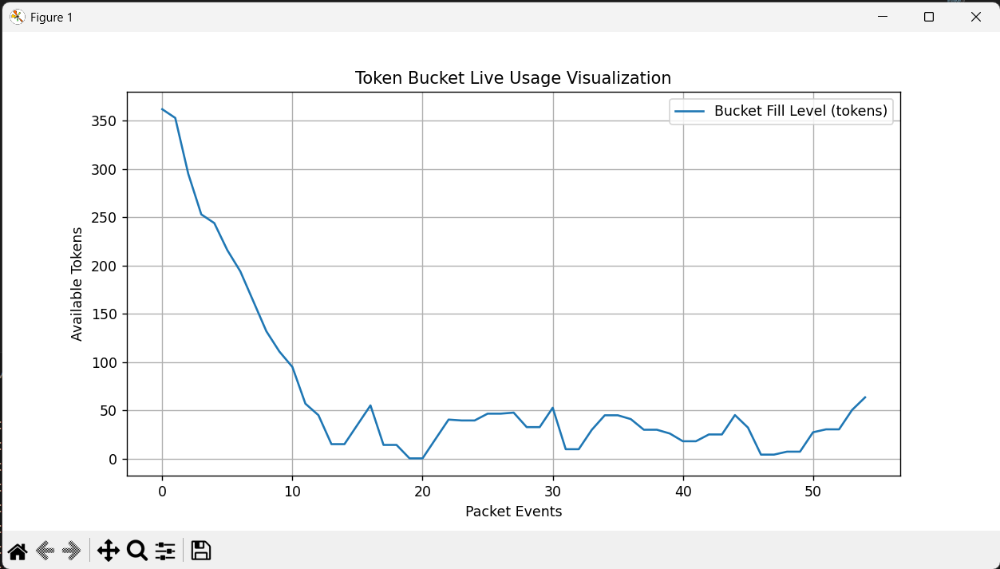

# Leaky Bucket Algorithm: Real-Time Bandwidth Monitoring and Rate Limiting in Python

## Overview

This project implements the Leaky Bucket algorithm for bandwidth monitoring and rate limiting. It features:

- Simulation of network packets
- Per-connection bandwidth control using a leaky bucket
- Real-time usage visualization with Matplotlib

## Features

- **Bandwidth Monitor:** Tracks and reports total allowed and denied data.
- **Rate Limiter:** Uses the Leaky Bucket algorithm to smooth out data bursts.
- **Dashboard:** Visualizes the fill state of the bucket versus time.

## How It Works

- Randomly sized "packets" mimic incoming client data.
- Each packet is checked against the Leaky Bucket's current fill and rate settings.
- Allowed packets reduce the bucket fill; denied packets simulate bandwidth policing.
- All bucket fill states are recorded and plotted after the run.

## Usage

1. **Install dependencies:**

   ```
   pip install matplotlib
   ```

2. **Run the script:**

   ```
   python leaky-bucket-algoritm.py
   ```

3. **Interpret output:**
   - Console shows allowed/denied packets.
   - Graph displays bucket usage over all events.
   - Final totals summarize performance.

## Example Output

    Packet of 15 bytes denied. Wait for bucket to drain.
    Packet of 65 bytes allowed.
    :
    :
    Packet of 68 bytes denied. Wait for bucket to drain..

    Total allowed data: 582 bytes
    Total denied data: 1505 bytes

##Leaky Bucket Live Usage Visualization

## Customization

- Change `capacity` and `rate` in the script to tune bandwidth and burst tolerance.
- Replace the simulation loop with real network data to enforce actual bandwidth limitations.

## References

- [GeeksforGeeks: Leaky Bucket Algorithm](https://www.geeksforgeeks.org/computer-networks/leaky-bucket-algorithm/)
- [GitHub: Leaky Bucket Python Example](https://github.com/sserkanml/leaky-bucket-algorithm)


